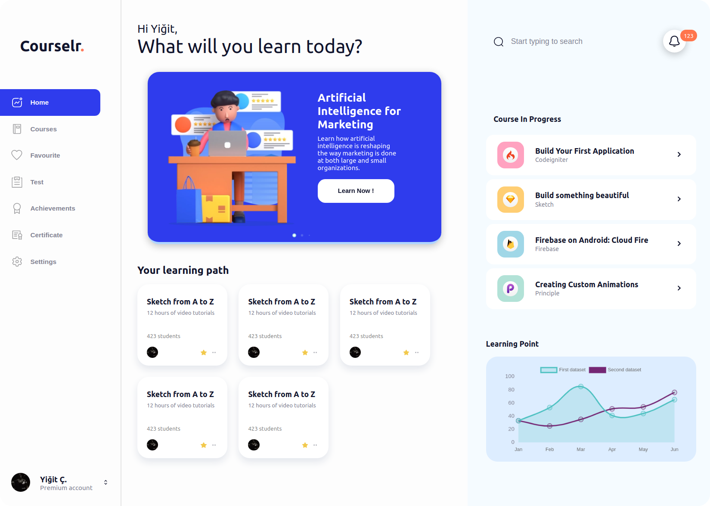
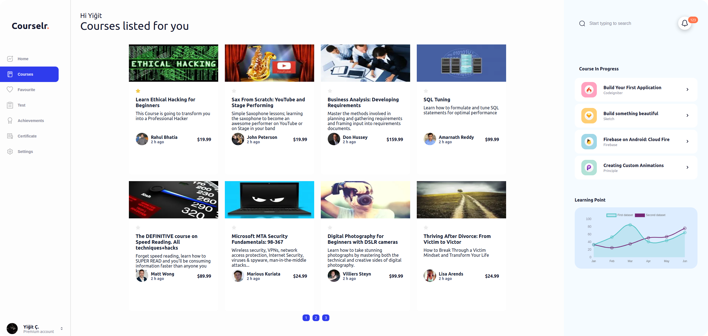

# Basic Course Tracking App

## Summary

My first React project and testing nextjs and redux skills. I think there are many mistakes in this project. But I did it to see my mistakes. I think Redux is a over-engineering for this project

There is no importance of responsive design in this project

## Technologies

* React

* Next.js

* Redux

* API: Udemy API

* Html & Sass

* SVGR

  

**Thanks to [Toda ✿](https://dribbble.com/todao) for the design**

[Elearn Dashboard](https://dribbble.com/shots/14730400-Elearn-Dashboard-Figma-Source)
